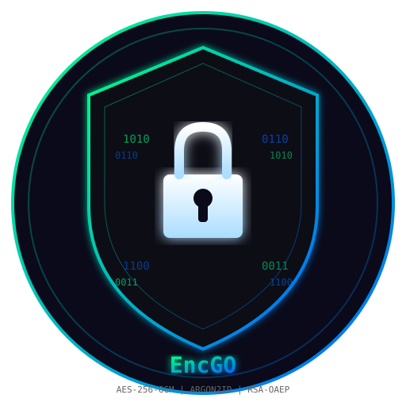

# EncGO

**Xul's file encryption vault** — a terminal-only, password-based encryption tool with military-grade cryptography and a clean CLI.



---

## Features

| Feature | Details |
|---------|---------|
| **AES-256-GCM** | Authenticated encryption — confidentiality + integrity in one pass |
| **Argon2id** | Memory-hard key derivation (GPU/ASIC resistant) with PBKDF2 fallback |
| **RSA-OAEP** | Wrap file keys with a recipient's public key for secure transfer |
| **Expiry timer** | Files can self-destruct after a set time (days, minutes, years) |
| **Use limit** | Restrict how many times a file can be decrypted (default 4, customizable) |
| **Secure shred** | 3-pass overwrite on expiry/limit — leaves nothing behind |
| **Streaming** | 64 KiB chunks — handles multi-GB files with constant memory |
| **No pickle** | Safe binary format — no arbitrary code execution risk |

---

## Dependencies

```bash
pip install cryptography argon2-cffi
```

| Package | Version | Purpose |
|---------|---------|---------|
| `cryptography` | ≥ 42.0 | AES-GCM, RSA-OAEP, PBKDF2, secure random |
| `argon2-cffi` | ≥ 23.1 | Argon2id key derivation |

---

## Installation

```bash
git clone https://github.com/CYBERWOLF333/EncGO.git
cd EncGO
pip install -r requirements.txt
```

---

## Usage

### Quick start

```bash
# Encrypt (prompts for passphrase)
python3 crypt.py secrets.txt

# Decrypt (prompts for passphrase)
python3 crypt.py secrets.txt.crypt
```

### All commands

```bash
# Encrypt with passphrase
python3 crypt.py file.txt -p "my passphrase"

# Encrypt with public key (for transfer)
python3 crypt.py file.txt --pubkey recipient.pem --expire 7d --max-uses 4

# Decrypt with private key
python3 crypt.py file.txt.crypt --privkey my_private.pem

# Decrypt with passphrase
python3 crypt.py file.txt.crypt -p "my passphrase"

# Generate a raw key
python3 crypt.py --keygen -o mykey.key

# Verify file header (no decryption)
python3 crypt.py --verify file.txt.crypt

# Force shred an expired/limited file
python3 crypt.py file.txt.crypt --force-shred
```

### Flags

| Flag | Description |
|------|-------------|
| `-p, --passphrase` | Passphrase (prompted if omitted) |
| `--pubkey` | Recipient's public key PEM (wraps file key) |
| `--privkey` | Your private key PEM (unwraps file key) |
| `-o, --output` | Output file path |
| `--expire` | Expiry: `7d`, `30m`, `1y`, `24h` |
| `--max-uses` | Max decrypt uses (default 4 with --expire/--shred) |
| `--shred` | Secure shred on expiry/limit |
| `--force-shred` | Force shred expired/limited file |
| `--keygen` | Generate a new key |
| `--verify` | Verify .crypt file header |
| `--banner` | Show Xul's banner |
| `--quote {hk,uk}` | Hollow Knight / Ultrakill quote |

---

## File Format

```
┌─────────────────────────────────────────────────────────┐
│  Header (52 bytes)                                      │
│  ├── Magic: "CRYPT1" (6 bytes)                          │
│  ├── Version: 1 (1 byte)                                │
│  ├── Flags: bitfield (1 byte)                           │
│  ├── Salt: 16 bytes (Argon2id)                          │
│  ├── Nonce: 12 bytes (AES-GCM)                          │
│  ├── Expiry: 8 bytes (Unix ms, 0 = never)               │
│  ├── Max uses: 4 bytes (0 = unlimited)                   │
│  └── Current uses: 4 bytes                              │
├─────────────────────────────────────────────────────────┤
│  Optional: Wrapped key (if --pubkey used)               │
│  ├── Length: 4 bytes                                    │
│  └── RSA-OAEP encrypted file key (256/384/512 bytes)    │
├─────────────────────────────────────────────────────────┤
│  Ciphertext (variable)                                  │
│  └── AES-256-GCM encrypted data                         │
├─────────────────────────────────────────────────────────┤
│  Tag (16 bytes)                                         │
│  └── GCM authentication tag                              │
└─────────────────────────────────────────────────────────┘
```

---

## Security Properties

- **Wrong password** and **tampered ciphertext** are indistinguishable — both fail closed
- **No partial output** — on decrypt error, the output file is removed
- **Refuses to overwrite** its own input file
- **Output files** created with mode `0600`
- **KDF parameters** bounds-checked to prevent DoS from crafted headers
- **Constant-time** tag verification (built into `cryptography`)
- **No key material** in logs, errors, or exceptions

---

## Easter Eggs

Try these as passphrases or filenames:

| Trigger | Game | Response |
|---------|------|----------|
| `void` | Hollow Knight | The void gazes back... |
| `radiance` | Hollow Knight | A blinding light sears your retinas |
| `pale king` | Hollow Knight | The White Palace doors creak open |
| `hornet` | Hollow Knight | *Needle clicks* |
| `v1` | Ultrakill | [V1 ACTIVATED] Blood fuel: 100% |
| `v2` | Ultrakill | [V2 ONLINE] Paradise lost |
| `gabriel` | Ultrakill | *trumpet sounds* |
| `minos` | Ultrakill | *gavel falls* |
| `sisyphus` | Ultrakill | Push the boulder. Again. Forever. |
| `xul` | — | The vault keeper |

---

## Exit Codes

| Code | Meaning |
|------|---------|
| 0 | Success |
| 1 | Usage error |
| 2 | Crypto failure (tamper/expiry/limit) |
| 3 | I/O error |

---

## License

MIT — use it, modify it, learn from it.

---

*EncGO — Sealed. Bound. Forgotten.*
